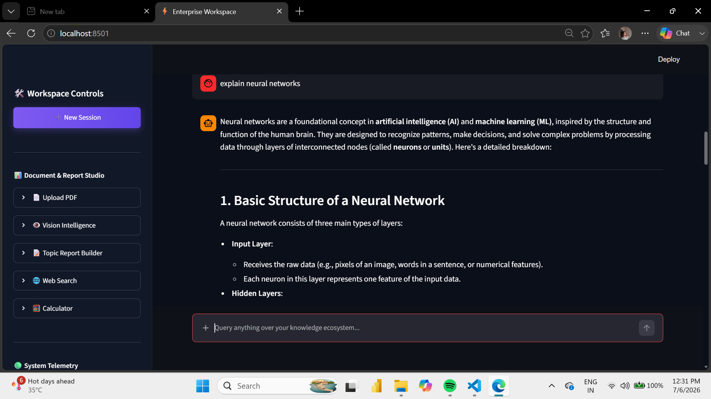
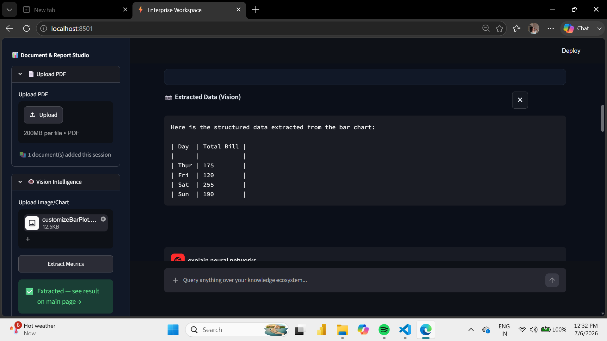
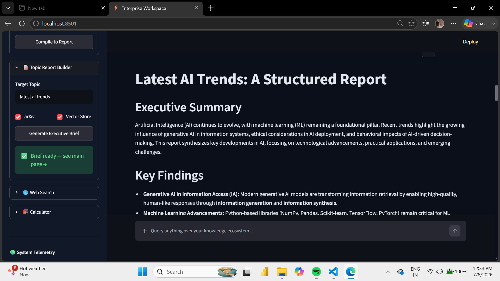

# 🚀 Enterprise Agentic RAG System

An end-to-end Enterprise AI Workspace built with **LangChain, LangGraph, ChromaDB, Mistral AI, and Streamlit**. This application combines Retrieval-Augmented Generation (RAG), Vision AI, Web Search, Report Generation, and Intelligent Document Processing into a single platform.

---

## 📸 Project Preview

### 🏠 Home Dashboard


### 📄 PDF Knowledge Base


### 💬 AI Chat


### 👁️ Vision Intelligence


### 📊 Report Generation


### 🌐 Web Search & 🧮 Calculator


---

## 🎥 Demo Video

Watch the complete project demo here:

https://enterprise-agentic-rag-system-e94pkupxmzwmppdtrqtp59.streamlit.app/

---

# ✨ Key Features

### 📄 PDF Knowledge Base
- Upload PDF documents
- Automatic text extraction & chunking
- Store embeddings in ChromaDB
- Ask questions over uploaded documents

### 💬 AI Chat Assistant
- Context-aware conversational interface
- Multi-turn conversations
- Agentic workflow powered by LangGraph

### 🔍 Intelligent Retrieval
- ChromaDB Vector Database
- MMR Retriever
- Multi Query Retrieval
- Semantic Search

### 🌐 Live Web Search
- Search real-time information from the web
- Retrieve the latest AI news and research
- Combine web results with LLM responses

### 👁️ Vision Intelligence
- Upload charts or images
- Extract structured information
- Generate AI-powered insights

### 📊 Report Generation
- Generate executive reports
- Build summaries from uploaded PDFs
- Create reports from Vision AI outputs
- Export downloadable reports

### 🧮 AI Calculator
- Perform mathematical calculations
- Supports arithmetic and square root operations
- Integrated directly into the workspace

### 📈 Research Assistant
- arXiv paper retrieval
- AI research exploration
- Technical document summarization

### ⚡ Enterprise Dashboard
- Clean Streamlit interface
- Workspace output panel
- Session management
- System telemetry

---

# 🛠 Tech Stack

- Python
- Streamlit
- LangChain
- LangGraph
- ChromaDB
- Mistral AI
- Tavily Search
- Hugging Face Embeddings
- PyPDFLoader
- Recursive Text Splitter

---

# 📂 Project Structure

```text
Enterprise-Agentic-RAG-System/
│── backend/
│── chroma-db/
│── app.py
│── create_database.py
│── main.py
│── requirements.txt
│── README.md
│── images/
```

# 🚀 Installation

```bash
git clone https://github.com/your-username/Enterprise-Agentic-RAG-System.git

cd Enterprise-Agentic-RAG-System

python -m venv .venv

.venv\Scripts\activate

pip install -r requirements.txt
```

# 🔑 Environment Variables

```env
MISTRAL_API_KEY=your_api_key
TAVILY_API_KEY=your_api_key
```

# ▶️ Run

```bash
streamlit run app.py
```

# 📌 Example Workflow

1. Upload a PDF
2. Ask questions about the document
3. Perform semantic retrieval
4. Analyze images
5. Generate reports
6. Search the web
7. Use calculator
8. Continue AI chat

# 🔮 Future Enhancements

- Multi-user authentication
- Cloud deployment
- Voice interaction
- Database integration
- Multi-document comparison

# 👩‍💻 Author

**Shagun Sharma**

AI • Machine Learning • Generative AI • Agentic AI • RAG
